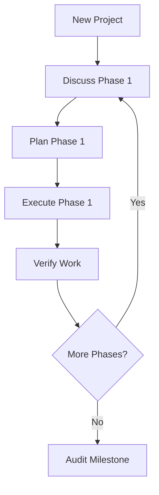

# GSD Workflows - Quick Start Guide

## What is GSD?

GSD (Get Shit Done) is a systematic approach to AI-driven development that prevents context degradation through:
- Fresh agent contexts per task
- Quality verification gates
- Atomic git commits
- Multi-phase workflows

## Quick Reference

### Complete Project Workflow



### Individual Workflows

| Workflow | When to Use | Input | Output |
|----------|-------------|-------|--------|
| **new-project** | Starting a new project | Project name, type, idea | Vision, requirements, roadmap |
| **discuss-phase** | Before planning a phase | Phase requirements | Implementation context |
| **plan-phase** | Creating task plans | Phase context, requirements | Verified task plans |
| **execute-phase** | Implementing tasks | Task plans | Code commits, summaries |
| **verify-work** | After phase completion | Deliverables | UAT results, fixes |
| **audit-milestone** | Completing a milestone | Phase results | Readiness assessment |
| **map-codebase** | Working with existing code | Codebase path | Architecture analysis |
| **iterative-convergence** | Quality-critical features | Feature spec | Refined implementation |

## Installation

```bash
# Install Babysitter SDK
npm i -g @a5c-ai/babysitter-sdk@latest

# Verify installation
babysitter --version
```

## Usage Patterns

### Pattern 1: New Web Application

```bash
# 1. Initialize project
babysitter run:create \
  --process-id gsd/new-project \
  --entry gsd/new-project.js#process \
  --inputs new-project-inputs.json

# 2. For each phase in roadmap:

# 2a. Discuss implementation preferences
babysitter run:create \
  --process-id gsd/discuss-phase \
  --entry gsd/discuss-phase.js#process \
  --inputs phase-1-inputs.json

# 2b. Plan with verification
babysitter run:create \
  --process-id gsd/plan-phase \
  --entry gsd/plan-phase.js#process \
  --inputs phase-1-planning-inputs.json

# 2c. Execute with atomic commits
babysitter run:create \
  --process-id gsd/execute-phase \
  --entry gsd/execute-phase.js#process \
  --inputs phase-1-execution-inputs.json

# 2d. Verify work
babysitter run:create \
  --process-id gsd/verify-work \
  --entry gsd/verify-work.js#process \
  --inputs phase-1-verify-inputs.json

# 3. Audit milestone when phases complete
babysitter run:create \
  --process-id gsd/audit-milestone \
  --entry gsd/audit-milestone.js#process \
  --inputs milestone-1-inputs.json
```

### Pattern 2: Brownfield Enhancement

```bash
# 1. Map existing codebase
babysitter run:create \
  --process-id gsd/map-codebase \
  --entry gsd/map-codebase.js#process \
  --inputs '{"codebasePath": ".", "analysisDepth": "comprehensive"}'

# 2. Use standard workflow with codebase context
# (Discuss → Plan → Execute → Verify)
```

### Pattern 3: Single High-Quality Feature

```bash
# Use iterative convergence for quality-critical work
babysitter run:create \
  --process-id gsd/iterative-convergence \
  --entry gsd/iterative-convergence.js#process \
  --inputs feature-inputs.json
```

## Input File Templates

### New Project Input
```json
{
  "projectName": "YourApp",
  "projectType": "web|mobile|api|desktop",
  "initialIdea": "Brief description",
  "context": {
    "targetAudience": "Who uses this",
    "keyDifferentiator": "What makes it unique",
    "constraints": ["Technical or business constraints"]
  }
}
```

### Phase Input
```json
{
  "phaseId": "phase-1-auth",
  "phaseName": "User Authentication",
  "requirements": [
    {
      "id": "REQ-1.1",
      "description": "Requirement description",
      "acceptanceCriteria": ["Criterion 1", "Criterion 2"],
      "priority": "must-have|should-have|nice-to-have"
    }
  ]
}
```

### Convergence Input
```json
{
  "feature": "Feature name",
  "targetQuality": 85,
  "maxIterations": 5,
  "requirements": ["Req 1", "Req 2"]
}
```

## Key Concepts

### 1. Fresh Context
Each agent task starts with a clean 200k context window. This prevents:
- Context degradation
- Confusion from unrelated information
- Quality decline over long sessions

### 2. Quality Gates
Verification at multiple levels:
- **Planning:** Plans verified against requirements
- **Execution:** Tasks verified after completion
- **Phase:** Phase verified against all requirements
- **Milestone:** Comprehensive audit

### 3. Atomic Commits
Each task produces one git commit:
- Enables `git bisect` for debugging
- Clear history of what changed when
- Easy rollback of specific features

### 4. Parallel Execution
Tasks run in parallel when possible:
- Research agents run simultaneously
- Independent tasks execute in parallel waves
- Maximizes throughput while maintaining quality

## Customization

### Extend a Workflow

```javascript
import { process as planPhase } from './plan-phase.js';

export async function process(inputs, ctx) {
  // Add custom pre-processing
  const enhanced = await ctx.task(customTask, inputs);

  // Run standard workflow
  const result = await planPhase(enhanced, ctx);

  // Add custom post-processing
  const final = await ctx.task(customFinalization, result);

  return final;
}
```

### Add Custom Task

```javascript
import { defineTask } from '@a5c-ai/babysitter-sdk';

export const myCustomTask = defineTask('my-task', (args, taskCtx) => ({
  kind: 'agent',
  title: 'My custom task',
  agent: {
    name: 'specialist',
    prompt: {
      role: 'role description',
      task: 'what to do',
      context: args,
      instructions: ['step 1', 'step 2'],
      outputFormat: 'JSON schema description'
    },
    outputSchema: { /* JSON schema */ }
  },
  io: {
    inputJsonPath: `tasks/${taskCtx.effectId}/input.json`,
    outputJsonPath: `tasks/${taskCtx.effectId}/result.json`
  },
  labels: ['custom', 'my-task']
}));
```

## Best Practices

### 1. Planning
- Discuss preferences before planning
- Iterate until plans are verified
- Keep plans atomic (1-2 hours of work each)

### 2. Execution
- Execute in parallel when possible
- Commit immediately after each task
- Verify before committing

### 3. Quality
- Set realistic quality targets (85+ is high)
- Allow iterations to reach quality goals
- Use agent scoring for objectivity

### 4. Breakpoints
- Review vision, requirements, roadmap
- Approve plans before execution
- Conduct thorough UAT
- Review audit results

## Troubleshooting

### Plans Fail Verification
- Review feedback from verifier
- Ensure requirements are clear
- Break down complex requirements
- Check that acceptance criteria are testable

### Tasks Fail Execution
- Check verification command is correct
- Ensure files specified exist
- Review error logs in task summary
- Consider breaking task into smaller pieces

### Quality Not Improving
- Review feedback from quality scorer
- Check if target is realistic
- Ensure feedback is being applied
- Consider adding more specific criteria

### Context Issues
- Ensure fresh context per task (don't reuse agents)
- Pass only necessary context, not everything
- Use artifacts for persistent state

## Examples

See `examples/` directory for complete working examples:
- `new-project-example.json` - Full project initialization
- `phase-example.json` - Authentication phase
- `milestone-example.json` - MVP milestone
- `convergence-example.json` - High-quality feature

## Getting Help

1. Review `README.md` for detailed documentation
2. Check `SUMMARY.md` for implementation details
3. Examine example input files
4. Review existing processes in `process/methodologies/`
5. Consult Babysitter SDK documentation

## Next Steps

1. Try `new-project.js` with example input
2. Customize workflows for your needs
3. Create reusable task definitions
4. Build project-specific compositions
5. Document your patterns

---

**Remember:** The complexity is in the system, not your workflow. These processes handle the orchestration so you can focus on building.
