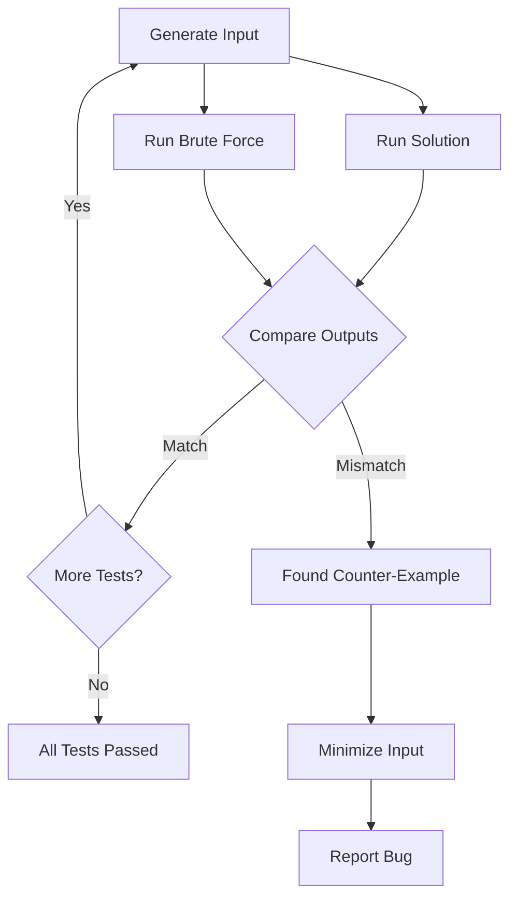

# Test Case Generator

A skill for generating comprehensive test cases for algorithm verification, including edge cases, stress tests, random inputs, and counter-example finding.

## Overview

The Test Case Generator skill helps validate algorithm correctness by generating diverse test inputs. It supports random generation, edge case enumeration, stress testing, and automated counter-example finding through brute force oracle comparison.

## Quick Start

### Basic Usage

```bash
# Generate random array test cases
test-case-generator array --count 100 --size 1000 --values -1e9,1e9

# Generate edge cases for array problems
test-case-generator edge-cases --type array --output edge_cases.json

# Stress test against brute force
test-case-generator stress --solution sol.cpp --brute brute.cpp
```

### Example: Two Sum Problem

```bash
# Define constraints
echo '{"n": [2, 10000], "values": [-1e9, 1e9]}' > constraints.json

# Generate test cases
test-case-generator generate \
  --template two-sum \
  --constraints constraints.json \
  --count 100 \
  --output tests/
```

## Features

### Test Generation Types

| Type | Description | Use Case |
|------|-------------|----------|
| **Random** | Uniformly distributed inputs | General coverage |
| **Edge Cases** | Boundary and special values | Corner case testing |
| **Stress** | Maximum constraint inputs | Performance testing |
| **Adversarial** | Worst-case inputs | Breaking weak solutions |

### Supported Data Structures

- **Arrays**: Sorted, random, with duplicates, permutations
- **Strings**: Random, palindromes, repeated patterns
- **Trees**: Binary, BST, balanced, line, star
- **Graphs**: Sparse, dense, DAG, cyclic, weighted
- **Matrices**: Square, rectangular, sparse
- **Numbers**: Integers, floating point, primes

## Use Cases

### Competitive Programming

```bash
# Stress test before submission
test-case-generator stress \
  --solution solution.cpp \
  --brute brute.cpp \
  --time-limit 2000 \
  --iterations 1000

# Output:
# Running stress test...
# Iteration 1-100: OK
# Iteration 101-200: OK
# ...
# All 1000 tests passed!
```

### Finding Counter-Examples

```bash
# Find minimal failing test case
test-case-generator find-counter \
  --solution buggy.cpp \
  --brute correct.cpp \
  --max-iterations 10000

# Output:
# Counter-example found at iteration 847!
# Input: n=5, arr=[3, 1, 4, 1, 5]
# Expected: 3
# Actual: 2
# Minimizing...
# Minimal input: n=3, arr=[1, 1, 2]
```

### Edge Case Generation

```python
# Automatic edge case generation
edge_cases = generate_edge_cases({
    'type': 'array',
    'constraints': {
        'n': (1, 100000),
        'values': (-1e9, 1e9)
    }
})

# Returns:
# - Empty array (if allowed)
# - Single element
# - Two elements
# - All same values
# - Sorted ascending
# - Sorted descending
# - Maximum size
# - Extreme values
```

## Generator Templates

### Array Problems

```python
from test_generator import ArrayGenerator

gen = ArrayGenerator(
    size_range=(1, 100000),
    value_range=(-10**9, 10**9)
)

# Random array
test1 = gen.random()

# Sorted array
test2 = gen.sorted(ascending=True)

# Array with duplicates
test3 = gen.with_duplicates(unique_ratio=0.1)

# Edge cases
edge_tests = gen.edge_cases()
```

### Graph Problems

```python
from test_generator import GraphGenerator

gen = GraphGenerator(
    nodes_range=(2, 1000),
    edges_range=(1, 10000)
)

# Random connected graph
g1 = gen.connected()

# Tree
g2 = gen.tree()

# DAG
g3 = gen.dag()

# Complete graph
g4 = gen.complete(n=100)

# Sparse graph
g5 = gen.sparse(n=1000, edge_factor=2)
```

### String Problems

```python
from test_generator import StringGenerator

gen = StringGenerator(
    length_range=(1, 100000),
    charset='abcdefghijklmnopqrstuvwxyz'
)

# Random string
s1 = gen.random()

# Palindrome
s2 = gen.palindrome()

# Repeated pattern
s3 = gen.repeated("ab", times=50000)

# String with specific characters
s4 = gen.from_charset("abc", length=10000)
```

## Stress Testing Workflow



## Configuration

### Generator Config File

```yaml
# generator.yaml
array:
  size:
    min: 1
    max: 100000
  values:
    min: -1000000000
    max: 1000000000

edge_cases:
  include:
    - empty
    - single
    - sorted
    - reverse_sorted
    - all_same
    - alternating

stress:
  iterations: 1000
  timeout_ms: 5000
  seed: 42
```

### CLI Options

```bash
test-case-generator generate \
  --type array \
  --count 100 \
  --seed 42 \
  --config generator.yaml \
  --output tests/ \
  --format json
```

## Output Formats

### JSON Format

```json
{
  "test_case_1": {
    "input": {
      "n": 5,
      "arr": [3, 1, 4, 1, 5],
      "target": 6
    },
    "expected": [1, 2],
    "category": "random",
    "seed": 42
  }
}
```

### Plain Text Format

```
5
3 1 4 1 5
6
```

### Multiple Files

```
tests/
  test_001.in
  test_001.out
  test_002.in
  test_002.out
  ...
```

## Integration Examples

### With LeetCode Fetcher

```javascript
// Fetch problem constraints
const problem = await fetchProblem('two-sum');
const constraints = parseConstraints(problem.constraints);

// Generate test cases
const tests = await generateTestCases({
  template: 'two-sum',
  constraints: constraints,
  count: 100
});

// Run and validate
for (const test of tests) {
  const result = mySolution(test.input);
  assert.deepEqual(result, bruteForce(test.input));
}
```

### With Complexity Analyzer

```javascript
// Generate scaled test cases for empirical analysis
const sizes = [100, 1000, 10000, 100000];
const testSuites = sizes.map(n => generateTestCase({ size: n }));

// Measure runtime at each scale
const measurements = testSuites.map(test => ({
  size: test.input.length,
  time: measureRuntime(solution, test)
}));

// Fit complexity curve
const empirical = fitComplexityCurve(measurements);
console.log(`Empirical complexity: ${empirical}`);
```

## API Reference

### `generate(options: GenerateOptions): TestCase[]`

Generate test cases with specified options.

### `stress(options: StressOptions): StressResult`

Run stress testing against brute force.

### `minimize(input: TestCase, checker: Function): TestCase`

Find minimal failing input through binary search.

### `edgeCases(constraints: Constraints): TestCase[]`

Generate standard edge cases for given constraints.

## Related Skills

- **leetcode-problem-fetcher**: Get problem constraints
- **complexity-analyzer**: Verify empirical complexity
- **solution-comparator**: Compare multiple solutions
- **correctness-verifier**: Formal correctness proofs

## References

- [testlib.h Documentation](https://codeforces.com/testlib)
- [QuickTest CLI](https://github.com/LuchoBazz/quicktest)
- [Stress Testing Guide](https://github.com/7oSkaaa/Stress_Testing)
- [Polygon Test Generator](https://polygon.codeforces.com/)
