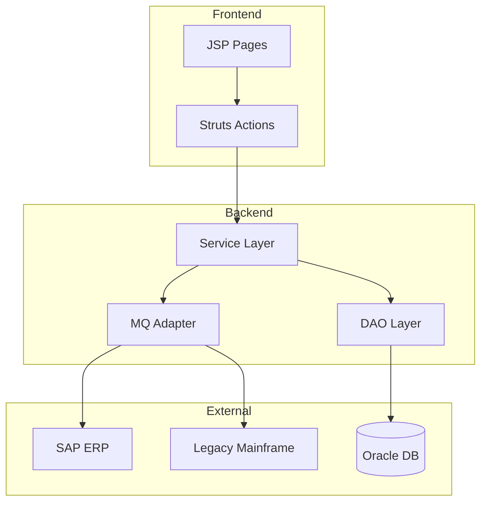

# Legacy System Archaeologist Agent

## Overview

The Legacy System Archaeologist is an expert agent for excavating and understanding legacy systems. It combines code archaeology techniques, business logic reconstruction, and tribal knowledge synthesis to create comprehensive documentation from underdocumented systems.

## Quick Start

### Prerequisites

- Access to the legacy codebase
- Git history (if available)
- Any existing documentation
- Optional: Interview notes from system experts

### Basic Usage

1. **Prepare the analysis environment**
   ```bash
   # Clone the legacy repository
   git clone <legacy-repo-url> ./legacy-analysis/code

   # Gather existing documentation
   mkdir ./legacy-analysis/docs
   cp -r <existing-docs>/* ./legacy-analysis/docs/
   ```

2. **Invoke the agent**
   ```javascript
   // In a Babysitter process
   const result = await ctx.task(legacyArchaeologyTask, {
     codebasePath: './legacy-analysis/code',
     documentationPath: './legacy-analysis/docs',
     scope: 'full'
   });
   ```

3. **Review outputs**
   ```bash
   # Generated documentation
   ls ./legacy-analysis/output/
   # - system-overview.md
   # - business-rules-catalog.md
   # - technical-debt-inventory.md
   # - risk-assessment.md
   # - architecture-diagrams/
   ```

## Features

### Code Archaeology Techniques

| Technique | Description | Output |
|-----------|-------------|--------|
| Git History Analysis | Trace code evolution | Change timeline |
| Dead Code Detection | Find unused features | Cleanup candidates |
| Pattern Recognition | Identify coding idioms | Technology map |
| Comment Mining | Extract inline knowledge | Documentation |
| Dependency Mapping | Map system connections | Integration diagram |

### Business Logic Extraction

The agent extracts business rules by analyzing:

- Validation functions
- Calculation methods
- Decision branches
- Configuration values
- Error messages
- Database constraints

### Documentation Generation

Produces comprehensive documentation:

1. **System Overview** - High-level architecture and purpose
2. **Component Catalog** - Detailed component descriptions
3. **Business Rules** - Extracted and documented rules
4. **Data Dictionary** - Data structures and flows
5. **Integration Map** - External system connections
6. **Risk Assessment** - Technical debt and concerns

## Configuration

### Agent Configuration

Create `legacy-archaeology-config.json`:

```json
{
  "analysis": {
    "depth": "comprehensive",
    "includeHistory": true,
    "historyDepth": "5-years",
    "analyzeComments": true,
    "extractBusinessRules": true
  },
  "scope": {
    "includePaths": ["src/", "lib/"],
    "excludePaths": ["vendor/", "node_modules/", "test/"],
    "focusAreas": ["core-business-logic", "integrations"]
  },
  "documentation": {
    "outputDir": "./legacy-analysis/output",
    "formats": ["markdown", "diagrams"],
    "generateDiagrams": true,
    "diagramFormats": ["mermaid", "plantuml"]
  },
  "riskAssessment": {
    "complexityThreshold": 10,
    "couplingThreshold": 15,
    "coverageThreshold": 30,
    "includeSecurityScan": true
  },
  "knowledgeSources": {
    "interviewNotes": "./legacy-analysis/interviews/",
    "existingDocs": "./legacy-analysis/docs/",
    "issueTracker": "https://jira.example.com/project/LEGACY"
  }
}
```

### Scope Options

| Scope | Analysis Depth | Time Estimate |
|-------|---------------|---------------|
| `quick` | Structure and dependencies only | Hours |
| `standard` | + Business logic extraction | 1-2 days |
| `comprehensive` | + History, interviews, full docs | 3-5 days |
| `deep` | + Security, compliance, all artifacts | 1-2 weeks |

## Output Examples

### System Overview Document

```markdown
# Legacy Inventory Management System

## Executive Summary

The Inventory Management System (IMS) is a Java-based application
developed between 2008-2015. It manages product inventory across
23 warehouses and integrates with 5 external systems including
SAP ERP and legacy mainframe systems.

## Technology Stack

| Layer | Technology | Version | Status |
|-------|------------|---------|--------|
| Frontend | JSP/Struts | 1.3 | EOL |
| Backend | Java | 1.6 | EOL |
| Database | Oracle | 11g | Supported |
| App Server | WebLogic | 10.3 | EOL |
| Messaging | IBM MQ | 7.5 | EOL |

## Architecture Overview



## Key Findings

1. **Critical Dependency**: Single point of failure in MQ integration
2. **Undocumented Feature**: Custom pricing algorithm in PriceCalculator.java
3. **Technical Debt**: 847 TODO comments, 23 FIXME markers
4. **Security Concern**: Hardcoded credentials in 3 locations
```

### Business Rules Catalog

```markdown
# Business Rules Catalog

## Domain: Inventory Management

### Rule: INV-001 - Reorder Point Calculation
- **Description**: Automatically trigger reorder when stock falls below threshold
- **Location**: `src/com/legacy/inventory/service/ReorderService.java:145`
- **Formula**: `reorderPoint = (avgDailySales * leadTimeDays) + safetyStock`
- **Variables**:
  - `avgDailySales`: 30-day rolling average
  - `leadTimeDays`: Supplier-specific (CONFIG table)
  - `safetyStock`: 20% of avg monthly sales
- **Exceptions**:
  - Seasonal items: Factor increased to 35%
  - Discontinued items: Reorder disabled
- **History**: Modified 2014-03 to add seasonal adjustment

### Rule: INV-002 - Stock Valuation
- **Description**: Calculate inventory value using FIFO method
- **Location**: `src/com/legacy/inventory/service/ValuationService.java:78`
- **Method**: First-In-First-Out (FIFO)
- **Special Cases**:
  - Returns: Valued at original purchase price
  - Damaged goods: Written down to 50%
  - Expired items: Written off completely
```

### Risk Assessment Summary

```markdown
# Risk Assessment Summary

## Critical Risks

| ID | Risk | Impact | Likelihood | Mitigation |
|----|------|--------|------------|------------|
| R1 | Java 1.6 EOL | Security vulnerabilities | High | Upgrade path needed |
| R2 | Single MQ connection | System downtime | Medium | Add redundancy |
| R3 | Hardcoded credentials | Security breach | High | Externalize secrets |

## Technical Debt Metrics

| Category | Count | Severity | Est. Effort |
|----------|-------|----------|-------------|
| Code Quality | 847 | Medium | 120 hours |
| Architecture | 12 | High | 200 hours |
| Security | 8 | Critical | 40 hours |
| Documentation | 156 | Low | 80 hours |

## Recommended Actions

1. **Immediate**: Remove hardcoded credentials
2. **Short-term**: Upgrade Java to supported version
3. **Medium-term**: Refactor MQ integration for resilience
4. **Long-term**: Plan full modernization
```

## Integration with Babysitter SDK

### Process Definition

```javascript
import { defineTask, defineProcess } from '@a5c-ai/babysitter-sdk';

export const legacyAnalysisProcess = defineProcess('legacy-analysis', {
  description: 'Comprehensive legacy system analysis',

  tasks: {
    archaeology: defineTask('archaeology', (args, ctx) => ({
      kind: 'agent',
      title: 'Legacy System Archaeology',
      agent: {
        name: 'legacy-system-archaeologist',
        prompt: {
          role: 'Legacy System Expert',
          task: 'Analyze and document legacy system',
          context: args,
          instructions: [
            'Survey code structure and technology stack',
            'Extract and document business rules',
            'Map integrations and dependencies',
            'Assess technical debt and risks',
            'Generate comprehensive documentation'
          ]
        }
      },
      io: {
        inputJsonPath: `tasks/${ctx.effectId}/input.json`,
        outputJsonPath: `tasks/${ctx.effectId}/result.json`
      }
    }))
  },

  flow: async (inputs, ctx) => {
    // Run archaeology
    const analysisResult = await ctx.task(tasks.archaeology, {
      codebasePath: inputs.targetPath,
      scope: inputs.analysisScope || 'comprehensive'
    });

    return {
      analysis: analysisResult,
      artifacts: {
        overview: `${inputs.outputDir}/system-overview.md`,
        rules: `${inputs.outputDir}/business-rules-catalog.md`,
        risks: `${inputs.outputDir}/risk-assessment.md`
      }
    };
  }
});
```

### Usage in Migration Planning

```javascript
// Use archaeology results for migration planning
const archaeologyResult = await runLegacyArchaeology(targetPath);

// Feed into migration readiness assessment
const readinessResult = await ctx.task(migrationReadinessTask, {
  legacyAnalysis: archaeologyResult,
  targetPlatform: 'cloud-native',
  constraints: migrationConstraints
});
```

## CLI Examples

### Analyze Specific Components

```bash
# Focus on business logic only
claude --agent legacy-system-archaeologist \
  --config '{"scope": {"focusAreas": ["core-business-logic"]}}'

# Include security analysis
claude --agent legacy-system-archaeologist \
  --config '{"riskAssessment": {"includeSecurityScan": true}}'

# Generate diagrams only
claude --agent legacy-system-archaeologist \
  --config '{"documentation": {"generateDiagrams": true, "formats": ["diagrams"]}}'
```

### Process Interview Notes

```bash
# Include interview transcripts
claude --agent legacy-system-archaeologist \
  --config '{"knowledgeSources": {"interviewNotes": "./interviews/*.md"}}'
```

## Troubleshooting

### Common Issues

**Analysis timeout**
```
Error: Analysis exceeded time limit
```
Solution: Reduce scope or analyze in phases

**Git history unavailable**
```
Warning: No git history found
```
Solution: Proceed with static analysis only; note reduced context

**Large codebase**
```
Warning: Codebase exceeds recommended size
```
Solution: Use `quick` or `standard` scope first, then deep-dive

### Debug Mode

```json
{
  "debug": {
    "enabled": true,
    "logLevel": "verbose",
    "saveIntermediateResults": true,
    "outputPath": "./debug-output"
  }
}
```

## Best Practices

1. **Preserve Original**: Never modify the legacy codebase during analysis
2. **Start Broad**: Begin with overview before deep diving
3. **Interview Experts**: Code doesn't capture all knowledge
4. **Verify Findings**: Cross-reference with actual system behavior
5. **Document Uncertainty**: Clearly mark assumptions
6. **Track Sources**: Note where each piece of information came from
7. **Iterative Refinement**: Multiple passes yield better results

## Related Documentation

- [AGENT.md](./AGENT.md) - Full agent specification
- [Legacy Modernizer Subagent](https://github.com/VoltAgent/awesome-claude-code-subagents)
- [Working Effectively with Legacy Code](https://www.oreilly.com/library/view/working-effectively-with/0131177052/)

## Version History

| Version | Date | Changes |
|---------|------|---------|
| 1.0.0 | 2026-01-24 | Initial release |
