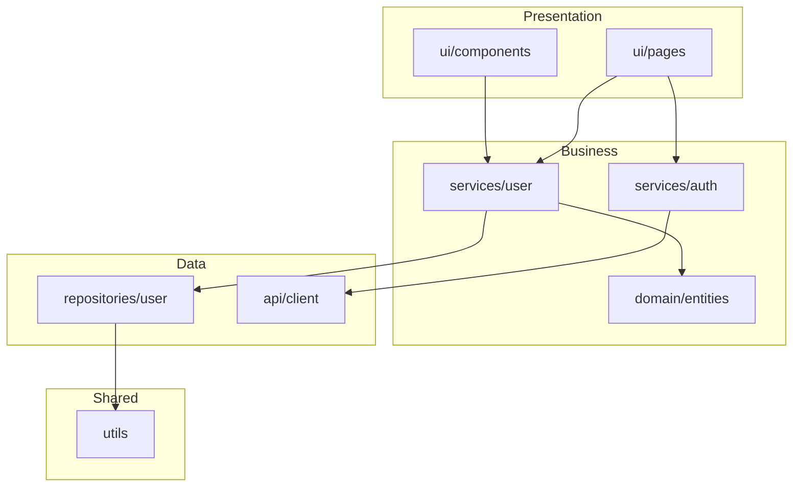

# Architecture Analyzer Skill

## Overview

The Architecture Analyzer skill provides comprehensive analysis of software architecture patterns, dependencies, and module boundaries. It supports migration planning by identifying coupling issues, architectural violations, and potential decomposition points.

## Quick Start

### Prerequisites

- Target codebase with defined module structure
- Optional analysis tools:
  - Madge (JavaScript/TypeScript)
  - JDepend (Java)
  - NDepend (.NET)

### Basic Usage

1. **Navigate to target project**
   ```bash
   cd /path/to/target/project
   ```

2. **Run architecture analysis**
   ```bash
   # For JavaScript/TypeScript projects
   madge --circular --json src/ > arch-analysis.json

   # For visualization
   madge --image arch-graph.svg src/
   ```

3. **Review results**
   - `arch-report/modules.json` - Module dependency data
   - `arch-report/violations.md` - Architectural violations
   - `arch-report/dependency-graph.svg` - Visual dependency graph

## Features

### Dependency Analysis

| Analysis Type | Description | Output |
|--------------|-------------|--------|
| Module Dependencies | Inter-module relationships | Dependency matrix |
| Circular Dependencies | Cyclic dependency chains | Cycle list |
| Layer Violations | Cross-layer dependencies | Violation report |
| External Dependencies | Third-party integrations | External map |

### Architecture Metrics

| Metric | Description | Formula |
|--------|-------------|---------|
| Afferent Coupling (Ca) | Incoming dependencies | Count of dependents |
| Efferent Coupling (Ce) | Outgoing dependencies | Count of dependencies |
| Instability (I) | Resistance to change | Ce / (Ca + Ce) |
| Distance (D) | From main sequence | \|A + I - 1\| |

### Visualization Formats

- **DOT**: Graphviz format for custom rendering
- **Mermaid**: Markdown-compatible diagrams
- **PlantUML**: UML-style diagrams
- **SVG/PNG**: Direct image output

## Configuration

### Project Configuration

Create `.architecture-analyzer.json`:

```json
{
  "analysisDepth": "module",
  "excludePaths": [
    "node_modules",
    "vendor",
    "dist",
    "build",
    ".git",
    "__tests__",
    "**/*.test.*",
    "**/*.spec.*"
  ],
  "modulePatterns": {
    "javascript": "src/*",
    "typescript": "src/*",
    "java": "src/main/java/**",
    "python": "src/*",
    "csharp": "src/**"
  },
  "layers": {
    "enabled": true,
    "definitions": [
      {
        "name": "presentation",
        "patterns": [
          "**/ui/**",
          "**/views/**",
          "**/controllers/**",
          "**/components/**",
          "**/pages/**"
        ],
        "allowedDependencies": ["business", "shared"]
      },
      {
        "name": "business",
        "patterns": [
          "**/services/**",
          "**/domain/**",
          "**/usecases/**",
          "**/application/**"
        ],
        "allowedDependencies": ["data", "shared"]
      },
      {
        "name": "data",
        "patterns": [
          "**/repositories/**",
          "**/dao/**",
          "**/persistence/**",
          "**/database/**"
        ],
        "allowedDependencies": ["shared"]
      },
      {
        "name": "shared",
        "patterns": [
          "**/common/**",
          "**/utils/**",
          "**/shared/**",
          "**/lib/**"
        ],
        "allowedDependencies": []
      }
    ]
  },
  "rules": {
    "maxCoupling": 10,
    "maxModuleSize": 5000,
    "maxCircularChainLength": 0,
    "forbiddenDependencies": [
      {
        "from": "presentation",
        "to": "data",
        "message": "UI should not directly access data layer"
      },
      {
        "from": "data",
        "to": "presentation",
        "message": "Data layer should not know about UI"
      }
    ]
  },
  "visualization": {
    "formats": ["mermaid", "dot", "svg"],
    "groupBy": "layer",
    "showMetrics": true,
    "colorScheme": {
      "presentation": "#4CAF50",
      "business": "#2196F3",
      "data": "#FF9800",
      "shared": "#9E9E9E"
    }
  },
  "output": {
    "directory": "./arch-report",
    "formats": ["json", "markdown"]
  }
}
```

## Output Examples

### Module Analysis (JSON)

```json
{
  "analysisId": "arch-20260124-143022",
  "timestamp": "2026-01-24T14:30:22Z",
  "target": {
    "path": "./src",
    "language": "typescript",
    "moduleCount": 24,
    "totalFiles": 156
  },
  "architecture": {
    "pattern": "layered",
    "layers": [
      {
        "name": "presentation",
        "modules": ["ui", "components", "pages"],
        "moduleCount": 8
      },
      {
        "name": "business",
        "modules": ["services", "domain"],
        "moduleCount": 10
      },
      {
        "name": "data",
        "modules": ["repositories", "api"],
        "moduleCount": 4
      },
      {
        "name": "shared",
        "modules": ["utils", "common"],
        "moduleCount": 2
      }
    ]
  },
  "modules": [
    {
      "name": "services/user",
      "path": "src/services/user",
      "files": 8,
      "linesOfCode": 1245,
      "dependencies": ["repositories/user", "domain/user", "utils"],
      "dependents": ["ui/user-profile", "ui/user-settings"],
      "metrics": {
        "afferentCoupling": 2,
        "efferentCoupling": 3,
        "instability": 0.6,
        "cohesion": 0.85
      }
    }
  ],
  "metrics": {
    "averageCoupling": 4.2,
    "maxCoupling": 12,
    "circularDependencies": 2,
    "layerViolations": 3
  }
}
```

### Violations Report (Markdown)

```markdown
# Architecture Violations Report

## Summary
- **Total Violations**: 5
- **Critical**: 2
- **Warning**: 3

## Critical Violations

### 1. Circular Dependency Chain

**Severity**: Critical
**Chain**: services/auth -> services/user -> services/permissions -> services/auth

**Impact**: Creates tight coupling, makes testing difficult, potential infinite loops.

**Recommendation**:
- Extract common interface to break the cycle
- Use dependency injection
- Consider event-based communication

### 2. Layer Bypass

**Severity**: Critical
**From**: ui/user-profile
**To**: repositories/user

**Rule Violated**: UI should not directly access data layer

**Recommendation**:
- Route through services/user-service
- Create appropriate service methods
```

### Dependency Graph (Mermaid)

```markdown

```

## Integration with Babysitter SDK

### Using in a Process

```javascript
import { defineTask } from '@a5c-ai/babysitter-sdk';

export const analyzeArchitectureTask = defineTask('analyze-architecture', (args, ctx) => ({
  kind: 'skill',
  title: 'Architecture Analysis',
  skill: {
    name: 'architecture-analyzer',
    context: {
      targetPath: args.projectPath,
      analysisDepth: args.depth || 'module',
      outputFormat: 'json',
      includeMetrics: true,
      generateVisualization: true
    }
  },
  io: {
    inputJsonPath: `tasks/${ctx.effectId}/input.json`,
    outputJsonPath: `tasks/${ctx.effectId}/result.json`
  }
}));
```

### Process Integration

This skill is used by these migration processes:

1. **legacy-codebase-assessment** - Architecture discovery
2. **monolith-to-microservices** - Service boundary identification
3. **migration-planning-roadmap** - Dependency-based sequencing
4. **code-refactoring** - Coupling reduction planning

## CLI Examples

### Using Madge (JavaScript/TypeScript)

```bash
# Find circular dependencies
madge --circular src/

# Generate dependency graph
madge --image dependency-graph.svg src/

# JSON output for processing
madge --json src/ > dependencies.json

# Check specific entry point
madge --circular --warning src/index.ts
```

### Using JDepend (Java)

```bash
# Analyze package dependencies
jdepend -file jdepend-report.txt target/classes/

# XML output
jdepend -file jdepend-report.xml target/classes/
```

### Using NDepend (.NET)

```bash
# Run analysis
NDepend.Console.exe /ProjectFile MyProject.ndproj /OutDir ./ndepend-report
```

## Troubleshooting

### Common Issues

**Too many modules detected**
```
Warning: Analysis found 500+ modules
```
Solution: Adjust `modulePatterns` to use higher-level groupings

**Circular dependency false positives**
```
Warning: Type-only imports flagged as circular
```
Solution: Configure tool to ignore type-only imports

**Missing dependencies**
```
Warning: Some imports could not be resolved
```
Solution: Ensure all source paths are included, check for path aliases

### Debug Mode

Enable verbose logging:

```json
{
  "debug": true,
  "logLevel": "verbose",
  "showResolvedPaths": true
}
```

## Best Practices

1. **Define Clear Boundaries**: Establish module and layer boundaries upfront
2. **Automate Checks**: Run architecture checks in CI/CD
3. **Track Trends**: Monitor coupling metrics over time
4. **Document Decisions**: Use ADRs for architectural changes
5. **Visualize Regularly**: Keep diagrams current
6. **Review Violations**: Address violations before they accumulate

## Related Documentation

- [SKILL.md](./SKILL.md) - Full skill specification
- [Madge Documentation](https://github.com/pahen/madge)
- [C4 Model](https://c4model.com/)
- [Clean Architecture](https://blog.cleancoder.com/uncle-bob/2012/08/13/the-clean-architecture.html)

## Version History

| Version | Date | Changes |
|---------|------|---------|
| 1.0.0 | 2026-01-24 | Initial release |
