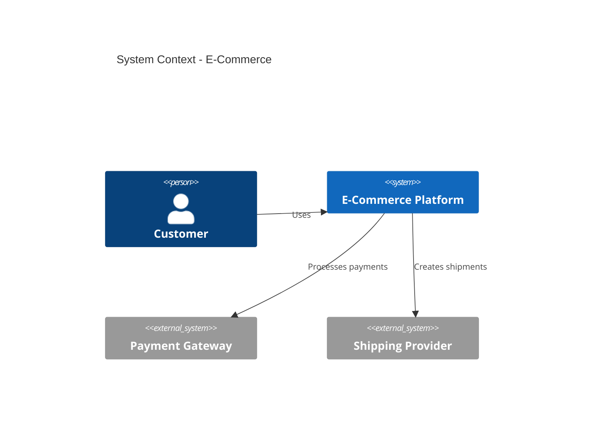
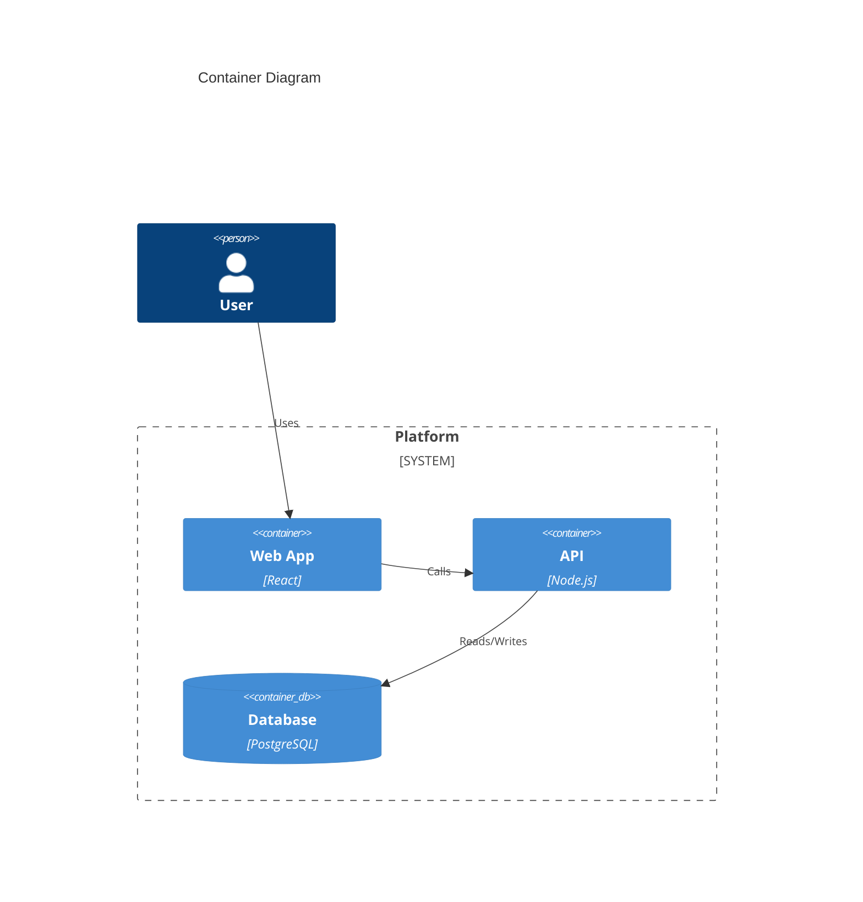

# Architecture Documentation Specialist Agent

## Overview

The `arch-docs-specialist` agent provides expertise in software architecture documentation, including C4 models, Architecture Decision Records (ADRs), system design documents, and technical specifications.

## Persona

| Attribute | Value |
|-----------|-------|
| **Role** | Architecture Documentation Lead |
| **Experience** | 8+ years in architecture documentation |
| **Background** | Software architecture, system design |
| **Philosophy** | "Good architecture docs enable decisions" |

## Core Expertise

1. **C4 Model** - Context, Container, Component, Code diagrams
2. **ADRs** - Architecture Decision Records
3. **System Design** - Design documents and specifications
4. **Data Flow** - Data architecture and flow diagrams
5. **arc42** - Comprehensive architecture documentation

## Usage

### Within Babysitter Processes

```javascript
const result = await ctx.task(archDocsTask, {
  agentName: 'arch-docs-specialist',
  prompt: {
    role: 'Architecture Documentation Lead',
    task: 'Create C4 model for e-commerce platform',
    context: {
      systemName: 'e-commerce-platform',
      requirements: requirementsDocs,
      existingDocs: architectureDocs
    },
    instructions: [
      'Create system context diagram',
      'Document container architecture',
      'Identify key components',
      'Document integration points'
    ],
    outputFormat: 'Markdown with Mermaid'
  }
});
```

### Direct Invocation

```bash
# Create C4 documentation
/agent arch-docs-specialist c4-model \
  --system e-commerce \
  --levels context,container

# Create ADR
/agent arch-docs-specialist create-adr \
  --title "Use Event-Driven Architecture" \
  --status proposed

# Generate design document
/agent arch-docs-specialist design-doc \
  --feature payment-processing
```

## Common Tasks

### 1. C4 Model Documentation

```bash
/agent arch-docs-specialist c4-model \
  --system payment-platform \
  --include-context \
  --include-containers \
  --format mermaid
```

Output:
- System Context Diagram
- Container Diagram
- Component Diagrams
- Diagram descriptions

### 2. ADR Creation

```bash
/agent arch-docs-specialist create-adr \
  --title "Database Selection" \
  --problem "Need to choose primary database" \
  --options "PostgreSQL,MongoDB,DynamoDB"
```

Output:
- ADR with MADR format
- Options analysis
- Decision rationale
- Consequences

### 3. Design Document

```bash
/agent arch-docs-specialist design-doc \
  --feature order-processing \
  --include-alternatives
```

Output:
- Design overview
- Architecture diagrams
- API specifications
- Alternatives analysis

## Documentation Templates

### C4 Context Diagram



### ADR Structure

```markdown
# ADR-0001: [Decision Title]

## Status
Proposed | Accepted | Deprecated | Superseded

## Context
[Problem statement and background]

## Decision
[The decision that was made]

## Consequences
[Good, bad, and neutral consequences]
```

### Design Document

```markdown
# Design: [Feature Name]

## Overview
[Summary of the design]

## Goals
- Goal 1
- Goal 2

## Proposed Design
[Architecture and implementation]

## Alternatives Considered
[Other options evaluated]
```

## Process Integration

| Process | Agent Role |
|---------|------------|
| `arch-docs-c4.js` | Create C4 model documentation |
| `adr-docs.js` | Manage ADRs |
| `data-model-docs.js` | Data architecture documentation |

## Documentation Principles

### Visual-First
- Lead with diagrams
- Use consistent notation
- Appropriate abstraction levels

### Decision-Focused
- Document the "why"
- Include alternatives
- Trace to requirements

### Stakeholder-Aware
- Different views for different audiences
- Executive summaries
- Technical deep-dives

## C4 Model Levels

| Level | Diagram | Audience | Detail |
|-------|---------|----------|--------|
| 1 | Context | Everyone | System + external actors |
| 2 | Container | Developers | Applications + data stores |
| 3 | Component | Developers | Internal components |
| 4 | Code | Developers | Class/code level |

## ADR States

| State | Meaning | Action |
|-------|---------|--------|
| Proposed | Under discussion | Gather feedback |
| Accepted | Decision made | Implement |
| Deprecated | No longer relevant | Keep for history |
| Superseded | Replaced | Link to new ADR |

## Example Output

### C4 Container Diagram



## References

- [C4 Model](https://c4model.com/)
- [MADR](https://adr.github.io/madr/)
- [arc42](https://arc42.org/)
- [Structurizr](https://structurizr.com/)
- [Mermaid Diagrams](https://mermaid.js.org/)

## Version History

| Version | Date | Changes |
|---------|------|---------|
| 1.0.0 | 2026-01-24 | Initial release |

---

**Backlog ID:** AG-006
**Category:** Architecture Documentation
**Status:** Active
