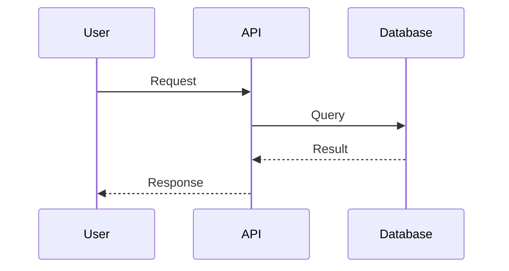

# MkDocs/Material Skill

MkDocs with Material theme expertise for Python-centric documentation.

## Capabilities

- Configure mkdocs.yml with Material theme features
- Set up navigation and table of contents
- Enable and configure MkDocs plugins (search, macros, mermaid)
- Admonition and code annotation usage
- Configure multi-language support
- Generate PDF export configurations
- Integrate with GitHub Pages deployment
- Enable blog and versioning features

## Usage

Invoke this skill when you need to:
- Set up MkDocs with Material theme
- Configure advanced theme features
- Add plugins for extended functionality
- Set up multi-language documentation
- Enable versioning with mike

## Inputs

| Parameter | Type | Required | Description |
|-----------|------|----------|-------------|
| action | string | Yes | init, configure, plugin, deploy |
| projectPath | string | Yes | Path to MkDocs project |
| config | object | No | Configuration options |
| plugins | array | No | Plugins to configure |
| locale | string | No | Language locale |

### Input Example

```json
{
  "action": "configure",
  "projectPath": "./docs",
  "config": {
    "site_name": "My Documentation",
    "site_url": "https://docs.example.com",
    "theme": "material"
  },
  "plugins": ["search", "mermaid2"]
}
```

## Project Configuration

### mkdocs.yml

```yaml
site_name: My Documentation
site_url: https://docs.example.com
site_description: Developer documentation for My Product
site_author: My Team

repo_name: my-org/my-project
repo_url: https://github.com/my-org/my-project
edit_uri: edit/main/docs/

theme:
  name: material
  language: en
  palette:
    - scheme: default
      primary: indigo
      accent: indigo
      toggle:
        icon: material/brightness-7
        name: Switch to dark mode
    - scheme: slate
      primary: indigo
      accent: indigo
      toggle:
        icon: material/brightness-4
        name: Switch to light mode
  font:
    text: Roboto
    code: Roboto Mono
  features:
    - navigation.instant
    - navigation.tracking
    - navigation.tabs
    - navigation.tabs.sticky
    - navigation.sections
    - navigation.expand
    - navigation.indexes
    - navigation.top
    - search.suggest
    - search.highlight
    - search.share
    - content.code.copy
    - content.code.annotate
    - content.tabs.link
  icon:
    repo: fontawesome/brands/github

plugins:
  - search:
      separator: '[\s\-,:!=\[\]()"/]+|(?!\b)(?=[A-Z][a-z])|\.(?!\d)|&[lg]t;'
  - minify:
      minify_html: true
  - git-revision-date-localized:
      enable_creation_date: true
      type: timeago
  - tags:
      tags_file: tags.md

markdown_extensions:
  - abbr
  - admonition
  - attr_list
  - def_list
  - footnotes
  - md_in_html
  - tables
  - toc:
      permalink: true
      toc_depth: 3
  - pymdownx.arithmatex:
      generic: true
  - pymdownx.betterem:
      smart_enable: all
  - pymdownx.caret
  - pymdownx.details
  - pymdownx.emoji:
      emoji_index: !!python/name:material.extensions.emoji.twemoji
      emoji_generator: !!python/name:material.extensions.emoji.to_svg
  - pymdownx.highlight:
      anchor_linenums: true
      line_spans: __span
      pygments_lang_class: true
  - pymdownx.inlinehilite
  - pymdownx.keys
  - pymdownx.mark
  - pymdownx.smartsymbols
  - pymdownx.superfences:
      custom_fences:
        - name: mermaid
          class: mermaid
          format: !!python/name:pymdownx.superfences.fence_code_format
  - pymdownx.tabbed:
      alternate_style: true
  - pymdownx.tasklist:
      custom_checkbox: true
  - pymdownx.tilde

extra:
  social:
    - icon: fontawesome/brands/github
      link: https://github.com/my-org
    - icon: fontawesome/brands/twitter
      link: https://twitter.com/my-org
  version:
    provider: mike
  analytics:
    provider: google
    property: G-XXXXXXXXXX
  consent:
    title: Cookie consent
    description: We use cookies to improve your experience.

extra_css:
  - stylesheets/extra.css

extra_javascript:
  - javascripts/extra.js

nav:
  - Home: index.md
  - Getting Started:
    - Installation: getting-started/installation.md
    - Quick Start: getting-started/quick-start.md
    - Configuration: getting-started/configuration.md
  - User Guide:
    - user-guide/index.md
    - Authentication: user-guide/authentication.md
    - API Usage: user-guide/api-usage.md
  - API Reference:
    - api/index.md
    - Client: api/client.md
    - Resources: api/resources.md
  - Contributing: contributing.md
  - Changelog: changelog.md
```

## Admonitions

### Standard Admonitions

```markdown
!!! note "Custom Title"
    This is a note with a custom title.

!!! tip
    This is a helpful tip.

!!! warning
    This is a warning message.

!!! danger "Critical"
    This is a critical danger message.

!!! info
    This is an informational note.

!!! success
    This indicates success.

!!! question
    This poses a question.

!!! quote
    This is a quotation.

??? example "Collapsible Example"
    This content is collapsible (closed by default).

???+ example "Collapsible Example (Open)"
    This content is collapsible (open by default).
```

## Code Annotations

### Annotated Code Blocks

````markdown
```python
import requests

# (1)!
response = requests.get(
    "https://api.example.com/users",
    headers={"Authorization": f"Bearer {token}"}  # (2)!
)

data = response.json()  # (3)!
```

1. Import the requests library for HTTP calls
2. Include authentication token in headers
3. Parse the JSON response
````

## Content Tabs

### Tabbed Content

```markdown
=== "Python"
    ```python
    import requests
    response = requests.get("https://api.example.com")
    ```

=== "JavaScript"
    ```javascript
    const response = await fetch("https://api.example.com");
    ```

=== "cURL"
    ```bash
    curl https://api.example.com
    ```
```

## Versioning with Mike

### mike Configuration

```bash
# Deploy version
mike deploy --push --update-aliases 1.0 latest

# Set default version
mike set-default --push latest

# List versions
mike list

# Delete version
mike delete 0.9
```

### Versioned Docs Structure

```yaml
# mkdocs.yml
extra:
  version:
    provider: mike
    default: latest
```

## Multi-language (i18n)

### mkdocs.yml i18n

```yaml
plugins:
  - i18n:
      default_language: en
      languages:
        - locale: en
          name: English
          build: true
        - locale: es
          name: Español
          build: true
        - locale: ja
          name: 日本語
          build: true
      nav_translations:
        es:
          Home: Inicio
          Getting Started: Empezando
        ja:
          Home: ホーム
          Getting Started: 始めよう
```

## PDF Export

### pdf-export Plugin

```yaml
plugins:
  - pdf-export:
      verbose: true
      media_type: print
      combined: true
      combined_output_path: pdf/complete-documentation.pdf
```

## Mermaid Diagrams

### Mermaid Integration

````markdown

````

## Macros Plugin

### Custom Macros

```yaml
# mkdocs.yml
plugins:
  - macros:
      module_name: docs/macros
```

```python
# docs/macros.py
def define_env(env):
    @env.macro
    def version():
        return "1.0.0"

    @env.macro
    def include_file(filename):
        with open(filename, 'r') as f:
            return f.read()
```

```markdown
<!-- Usage in docs -->
Current version: {{ version() }}

{{ include_file("examples/config.yaml") }}
```

## Workflow

1. **Initialize project** - Create MkDocs project structure
2. **Configure theme** - Set up Material theme
3. **Add plugins** - Enable required plugins
4. **Structure navigation** - Configure nav in mkdocs.yml
5. **Add content** - Write Markdown documentation
6. **Build** - Generate static site
7. **Deploy** - Publish to hosting

## Dependencies

```text
# requirements.txt
mkdocs>=1.5.0
mkdocs-material>=9.4.0
mkdocs-material-extensions>=1.3.0
mkdocs-minify-plugin>=0.7.0
mkdocs-git-revision-date-localized-plugin>=1.2.0
mkdocs-macros-plugin>=1.0.0
mike>=2.0.0
```

## CLI Commands

```bash
# Create new project
mkdocs new my-docs

# Start development server
mkdocs serve

# Build static site
mkdocs build

# Deploy to GitHub Pages
mkdocs gh-deploy

# Deploy versioned docs with mike
mike deploy --push --update-aliases 1.0 latest
```

## Best Practices Applied

- Use navigation tabs for top-level sections
- Enable instant loading for SPA experience
- Configure search suggestions
- Add code copy buttons
- Use admonitions for callouts
- Enable dark/light mode toggle
- Add social links in footer

## References

- MkDocs: https://www.mkdocs.org/
- Material for MkDocs: https://squidfunk.github.io/mkdocs-material/
- PyMdown Extensions: https://facelessuser.github.io/pymdown-extensions/
- mike: https://github.com/jimporter/mike

## Target Processes

- docs-as-code-pipeline.js
- docs-versioning.js
- knowledge-base-setup.js
- how-to-guides.js
